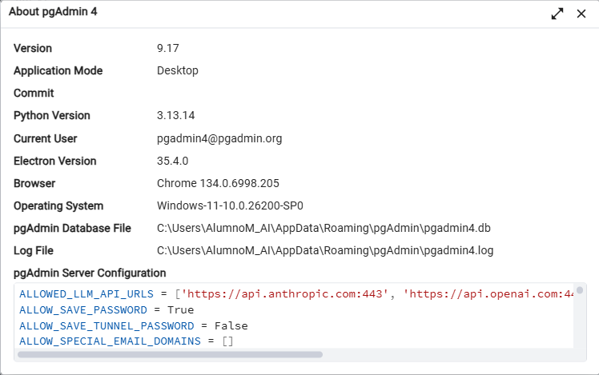
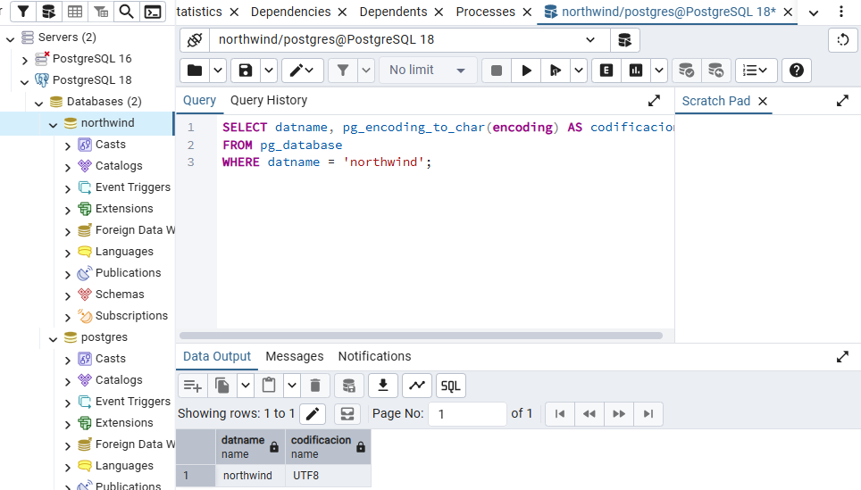
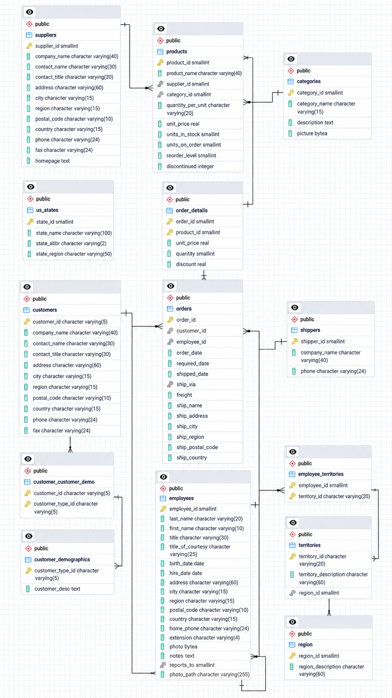
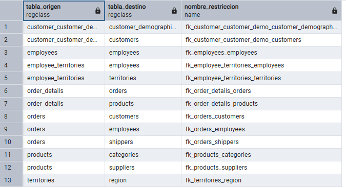

# Práctica de SQL: northwind-sql

## Autor

Nombre y apellidos: Lorenley Rodriguez

## Entorno

-Sistema operativo: Windows 11
-PostgreSQL 18.6 
-Version de pgAdmin

## Preparación de la base de datos
1. Instalación de PostgreSQL 18 y pgAdmin4
2. Creacion de la base de datos `northwind`, se debe prestar especial atención a que la codificación de sea correcta. Observese el SQL Query para verificarlo.
   

4. Ejecución del script Northwind para creación y carga de las tablas
5. Comprobar que las 14 tablas estén correctas, con sus primary keys y foreign keys
6. Además, se genera un diagrama ERDM para la base de datos 
      

Adicional tenemos el resultado de una consulta con todas las relaciones presentes en northwind
      
