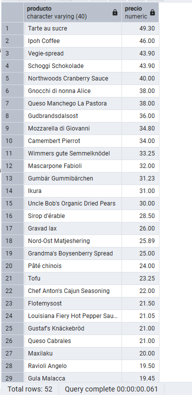
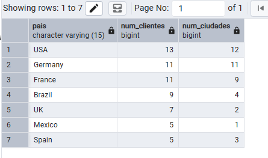

# Resolución de consultas — Northwind

## Pregunta 1 —  Catálogo comercial activo

**Enunciado:** Obtén los productos que no están descatalogados y cuyo precio unitario esté entre 10 y 50 euros, ambos incluidos. Muestra el nombre del producto y su precio redondeado a dos decimales, ordenado de mayor a menor precio.

**Consulta:**

```sql
-- Productos no estás descontinuados cuyo precio está entre 10  y 50 ordenados de mayor a menor precio
SELECT product_name AS producto, 
ROUND((unit_price::numeric), 2) AS precio
FROM products
WHERE discontinued =0 
AND unit_price BETWEEN 10 AND 50
ORDER BY precio DESC;
```

**Resultado:**



**Comentario:** Se ha usado ROUND() porque es lo que se ha solicitado con los numéricos que representan dinero; además de eso en la condición se utiliza el nombre de la columna original pero a la hora de ordenar se usa el alias creado para la columna porque la consulta ya está hecha y la columna renombrada. 

## Pregunta 2 —  Concentración geográfica de la cartera

**Enunciado:** Cuenta cuántos clientes hay en cada país y muestra únicamente aquellos países con 5 o más clientes, ordenados de mayor a menor. Indica también cuántas ciudades distintas hay en cada uno de esos países.

**Consulta:**

```sql
-- Número de clientes en cada país, incluido cuantas ciudades hay de cada país ordenado de mayor número de clientes a menos
SELECT 
	country AS pais,
	COUNT(*) AS num_clientes,
	COUNT(DISTINCT city) AS num_ciudades
FROM customers
GROUP BY country
HAVING COUNT(*) >= 5
ORDER BY num_clientes DESC;
```

**Resultado:**



**Comentario:** Se utiliza HAVING() al tener un GROUP BY porque el filtro pasa por los grupos creados, uno por cada pais. Adicional a eso, se usa el COUNT(DISCTINCT...) porque no se desea contar todas las ciudades en cada país de cada cliente, sino el número de ciudades activas (con clientes) en cada país.
