# Resolución de consultas — Northwind

## Pregunta 1 —  Catálogo comercial activo

**Enunciado:** Obtén los productos que no están descatalogados y cuyo precio unitario esté entre 10 y 50 euros, ambos incluidos. Muestra el nombre del producto y su precio redondeado a dos decimales, ordenado de mayor a menor precio.

**Consulta:**

```sql
-- Productos no estás descontinuados cuyo precio está entre 10  y 50 ordenados de mayor a menor precio
SELECT product_name AS producto, 
ROUND((unit_price::numeric), 2) AS precio
FROM products
WHERE discontinued =0 
AND unit_price BETWEEN 10 AND 50
ORDER BY precio DESC;
```

**Resultado:**


**Comentario:** Se ha usado ROUND() porque es lo que se ha solicitado con los numéricos que representan dinero; además de eso en la condición se utiliza el nombre de la columna original pero a la hora de ordenar se usa el alias creado para la columna porque la consulta ya está hecha y la columna renombrada. 

## Pregunta 2 —  Concentración geográfica de la cartera

**Enunciado:** Cuenta cuántos clientes hay en cada país y muestra únicamente aquellos países con 5 o más clientes, ordenados de mayor a menor. Indica también cuántas ciudades distintas hay en cada uno de esos países.

**Consulta:**

```sql
-- Número de clientes en cada país, incluido cuantas ciudades hay de cada país ordenado de mayor número de clientes a menos
SELECT 
	country AS pais,
	COUNT(*) AS num_clientes,
	COUNT(DISTINCT city) AS num_ciudades
FROM customers
GROUP BY country
HAVING COUNT(*) >= 5
ORDER BY num_clientes DESC;
```

**Resultado:**


**Comentario:** Se utiliza HAVING() al tener un GROUP BY porque el filtro pasa por los grupos creados, uno por cada pais. Adicional a eso, se usa el COUNT(DISCTINCT...) porque no se desea contar todas las ciudades en cada país de cada cliente, sino el número de ciudades activas (con clientes) en cada país.

## Pregunta 3 —  Alerta de reposición

**Enunciado:** Localiza los productos activos cuyas unidades en stock sean inferiores o iguales a su nivel de reposición. Muestra el nombre, las unidades en stock, el nivel de reposición, las unidades ya pedidas al proveedor y una columna de texto que indique 'CRÍTICO' cuando el stock sea 0 y 'AVISO' en el resto de casos.

**Consulta:**

```sql
-- Productos activos cuyas unidades de stock sean iguales o inferior a la reposición
SELECT
	product_name AS producto,
	units_in_stock AS stock,
	reorder_level AS nivel_reposición, 
	units_on_order AS pedido_a_proveedor, 
	CASE units_in_stock
	WHEN 0 THEN 'CRÍTICO'
	ELSE 'AVISO' 
	END AS situacion
FROM products
WHERE discontinued =0
AND units_in_stock IS NOT NULL
AND units_in_stock >= reorder_level;
```

**Resultado:**

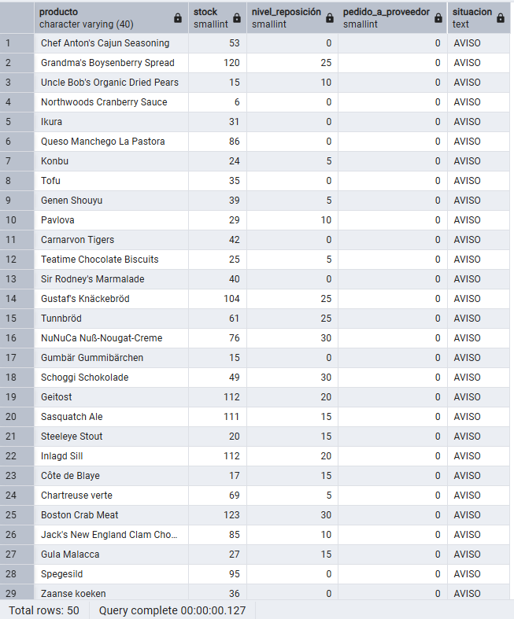

**Comentario:** Se tomo en cuenta al consultar cuales columnas aceptan NULL o no, y así se determinó que otro filtro a considerar era donde el stock no estuviera en NULL y así contar con los que SI tuvieran contenido en dicha columna. Se destaca además el uso de CASE WHEN en la columna situación, donde según el stock advertía con 'CRÍTICO' o 'AVISO'. 

## Pregunta 4 — Ficha completa de producto

**Enunciado:** Para los productos suministrados por empresas de Italia, Francia o España, muestra el nombre del producto, el nombre de la categoría, el nombre del proveedor, su país y su ciudad. Ordena por país y, dentro de cada país, por nombre de producto.

**Consulta:**

```sql
-- Productos suministrados por empresas de Italia, Francia o España
SELECT
    p.product_name AS producto,
    c.category_name AS categoria,
    s.company_name AS proveedor,
    s.country AS pais,
    s.city AS ciudad
FROM products p
INNER JOIN categories c
    ON p.category_id = c.category_id
INNER JOIN suppliers s
    ON p.supplier_id = s.supplier_id
WHERE s.country IN ('Italy', 'France', 'Spain')
ORDER BY s.country, p.product_name;
```

**Resultado:**

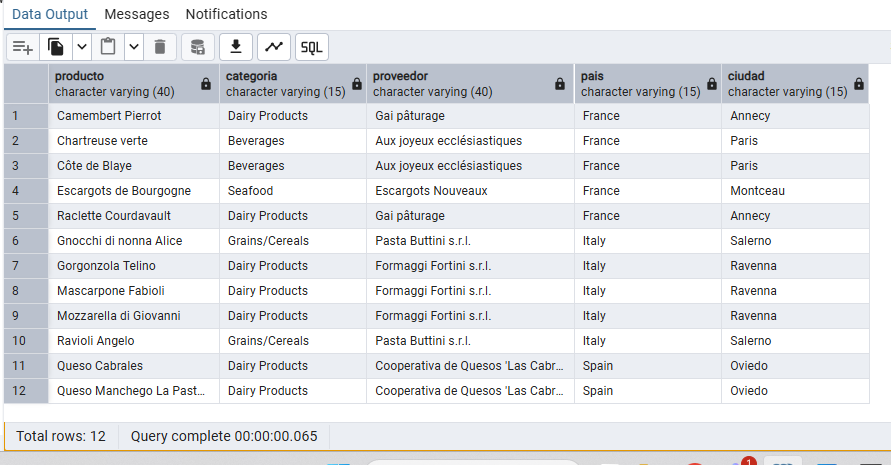

**Comentario:** Se usa INNER JOIN porque es necesario tomar las coincidencias en todas las tablas donde los datos estén llenos, es decir productos con categoría y proveedor asociado. El país se encuentra en la tabla `suppliers` 

## Pregunta 5 — Detalle valorizado de un pedido

**Enunciado:** Muestra, para ese pedido, el nombre del producto, el precio unitario aplicado, la cantidad, el descuento y el importe final de cada línea. Añade el nombre del cliente y la fecha del pedido.

**Consulta:**

```sql
-- Información sobre el pedido 10248
SELECT c.company_name AS cliente,
		o.order_date AS fecha_pedido,
		p.product_name AS producto,
    	ROUND(od.unit_price::numeric, 2) AS precio_unitario,
		od.quantity AS cantidad,
		od.discount AS descuento,
		 ROUND(
        		od.unit_price::numeric * od.quantity *
        		(1 - od.discount::numeric),2)
		AS importe_linea
FROM orders o 
INNER JOIN customers c USING(customer_id)
INNER JOIN order_details od USING(order_id)
INNER JOIN products p USING (product_id)
WHERE o.order_id = 10248;
```

**Resultado:**

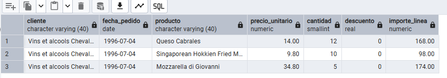

**Comentario:** Se usa USING(columna), con las primary key que relacionan las tablas consultadas entre sí y de esta manera la columna no aparece duplicada en el resultado.

## Pregunta 6 — Ranking de categorías por facturación

**Enunciado:** Calcula la facturación total de cada categoría durante toda la historia de la compañía. Muestra el nombre de la categoría, el número de líneas de pedido que ha generado, el número de productos distintos vendidos y la facturación total. Incluye únicamente las categorías que superen los 100.000 euros de facturación, ordenadas de mayor a menor..

**Consulta:**

```sql
-- Facturación total de cada categoría de producto durante toda la historia.
SELECT c.category_name AS categoria, 
		COUNT(*) AS num_lineas,
		COUNT(DISTINCT od.product_id) AS num_productos,
		ROUND(SUM(
            		od.unit_price::numeric * od.quantity *(1 - od.discount::numeric)),2) AS facturacion	
FROM categories c
INNER JOIN products p 
	ON c.category_id = p.category_id
INNER JOIN order_details od 
	ON p.product_id = od.product_id
GROUP BY c.category_name
HAVING (SUM(od.unit_price::numeric * od.quantity *(1 - od.discount::numeric))) > 100000
ORDER BY facturacion DESC;
```

**Resultado:**

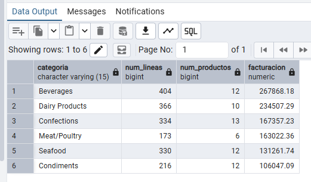

**Comentario:** Agrupo las líneas de pedido por categoría para obtener su facturación total y cuento los productos distintos. Uso HAVING porque el filtro de 100.000 € se aplica después de calcular la suma de cada categoría.

## Pregunta 7 — Clientes sin actividad comercial

**Enunciado:** Lista todos los clientes con el número de pedidos que ha realizado cada uno y la fecha de su último pedido. Los clientes sin ningún pedido deben aparecer igualmente, con un 0 en el conteo y el texto 'SIN PEDIDOS' en lugar de la fecha. Ordena de forma que los clientes inactivos aparezcan primero.

**Consulta:**

```sql
-- Todos los clientes activos o no con su número de pedidos y último pedido
SELECT c.company_name AS cliente, 
		c.country AS pais, 
		COUNT(o.order_id) AS num_pedidos,
		COALESCE(MAX(o.order_date)::text, 'SIN PEDIDOS') AS ultimo_pedido
FROM customers c
LEFT JOIN orders o ON c.customer_id = o.customer_id
GROUP BY c.customer_id, c.company_name, c.country
ORDER BY num_pedidos;

```

**Resultado:**

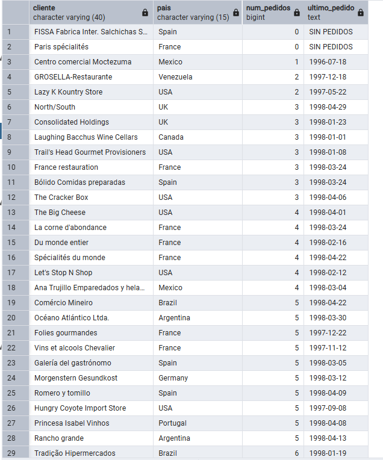

**Comentario:** Se filtra también por c.customer_id para asegurarnos que se cree un registro por cada cliente existente. 
El `LEFT JOIN`es necesario porque nos asegura que TODOS los cliente sean incluidos. `COUNT(o.order_id)` para asegurarnos que toma el número de pedidos realmente, y no tome en cuenta el `NULL` como un registro. 

## Pregunta 8 — Organigrama de la fuerza de ventas
**Enunciado:** Muestra cada empleado con su nombre completo, su cargo, el nombre completo de la persona a la que reporta y el cargo de esa persona. El empleado que no reporta a nadie debe aparecer también, con el texto 'DIRECCIÓN GENERAL' en el campo del responsable.


**Consulta:**

```sql
--Organigrama del departamento comercial en formato tabla.
SELECT emp.first_name || ' ' || emp.last_name AS empleado,
		emp.title AS cargo,
		COALESCE(
			jefe .first_name || ' ' || jefe .last_name, 'DIRECCIÓN GENERAL'
		) AS responsable,
		jefe.title AS cargo_responsable
FROM employees emp
LEFT JOIN employees jefe 
	ON emp.reports_to = jefe .employee_id
ORDER BY empleado;
```

**Resultado:**

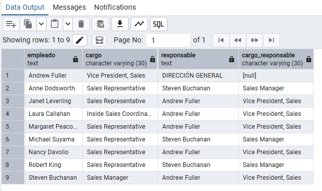

**Comentario:** Se hace un `SELF-JOIN` con un `LEFT JOIN` desde empleados de manera que se conserva aquellos empleados que no tienen jefe. Se nombran las dos tablas distintas `emp` y `jefe`. Además de eso se usa `COALESCE()` para cuando el jefe de un empleado no señale a nadie, aparezca la dirección general. 

## Pregunta 9 — Rejilla de cobertura categoría × año
**Enunciado:** Genera todas las combinaciones posibles de las 8 categorías con los 3 años del histórico (24 filas) y asocia a cada combinación su facturación. Ordena por categoría y año.


**Consulta:**

```sql
-- Rejilla completa de facturación por categoria y año, sin huecos.
SELECT
    c.category_name AS categoria,
    a.anio,
    COALESCE(ROUND(y.facturacion, 2), 0) AS facturacion
FROM categories c
CROSS JOIN (
    VALUES (1996), (1997), (1998)) AS a(anio)
LEFT JOIN (
    SELECT
        p.category_id,
        EXTRACT(YEAR FROM o.order_date)::integer AS anio,
        SUM(
            od.unit_price::numeric * od.quantity *
            (1 - od.discount::numeric)
        ) AS facturacion
    FROM orders o
    INNER JOIN order_details od
        ON o.order_id = od.order_id
    INNER JOIN products p
        ON od.product_id = p.product_id
    GROUP BY
        p.category_id,
        EXTRACT(YEAR FROM o.order_date)
) y
    ON c.category_id = y.category_id
    AND a.anio = y.anio
ORDER BY c.category_name, a.anio;
```

**Resultado:**

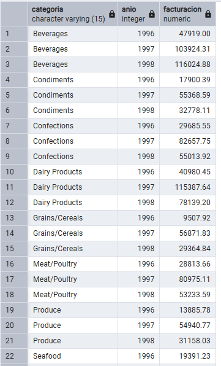

**Comentario:** . El CROSS JOIN genera primero las 24 combinaciones posibles entre 8 categorías y 3 años. Después, el LEFT JOIN incorpora la facturación real y COALESCE() convierte en 0 las combinaciones sin ventas.


## Pregunta 10 —  Mapa de países: clientes frente a proveedores
**Enunciado:** Expansión internacional quiere una única tabla que muestre, para cada país en el que la compañía tiene presencia, cuántos clientes y cuántos proveedores hay. Deben aparecer los países que solo tienen clientes, los que solo tienen proveedores y los que tienen ambos.


**Consulta:**

```sql
-- Presencia de clientes y proveedores por país
SELECT COALESCE(s.pais, c.pais) AS pais,
		s.num_proveedores,
		c.num_clientes,
		CASE 
			WHEN num_proveedores IS NULL THEN 'SOLO CLIENTES'
			WHEN num_clientes IS NULL THEN 'SOLO PROVEEDORES'
			ELSE 'AMBOS'
		END AS tipo_presencia

FROM (
	SELECT country AS pais,
			COUNT(*) AS num_proveedores
	FROM suppliers
	GROUP BY country
) s
FULL JOIN (
	SELECT country AS pais,
			COUNT(*) AS num_clientes
	FROM customers
	GROUP BY country
) c 
		USING(pais)
ORDER BY pais;
```

**Resultado:**

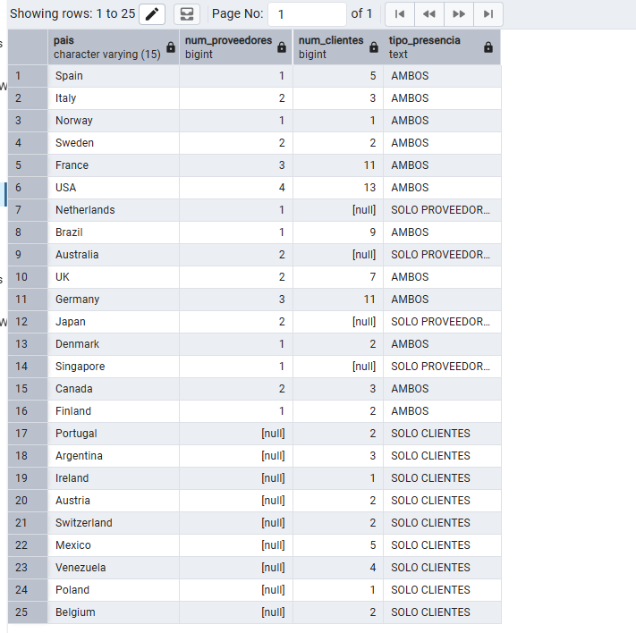

**Comentario:** . Agrupo primero clientes y proveedores por país y después uso FULL JOIN para conservar países presentes solo en uno de los dos grupos. COALESCE(c.pais, p.pais) permite obtener siempre el país correcto independientemente del lado del que proceda.


## Pregunta Pregunta 11 — Directorio unificado de contactos
**Enunciado:** Construye una sola tabla que reúna los contactos de clientes, los de proveedores y los empleados. Cada fila debe indicar el origen (`'CLIENTE'`, `'PROVEEDOR'`, `'EMPLEADO'`), el nombre de la persona de contacto **en mayúsculas**, la organización a la que pertenece, la ciudad y el país. Para los empleados, la organización es el literal `'NORTHWIND TRADERS'` y el nombre de contacto se forma concatenando nombre y apellidos.

Ordena por origen y luego por país.


**Consulta:**

```sql
-- Exportación única con todos los contactos de la compañia
SELECT 'CLIENTE' AS origen,
	UPPER(contact_name) AS contacto,
	company_name AS organizacion,
	city AS ciudad,
	country AS pais
FROM customers

UNION ALL 

SELECT 'PROVEEDOR',
		UPPER(contact_name),
		company_name,
		city,
		country
FROM suppliers

UNION ALL 

SELECT 'EMPLEADO',
		UPPER(first_name) || ' ' || UPPER(last_name),
		'NORTHWIND TRADERS' ,
		city,
		country
FROM employees

ORDER BY origen, pais;
```

**Resultado:**

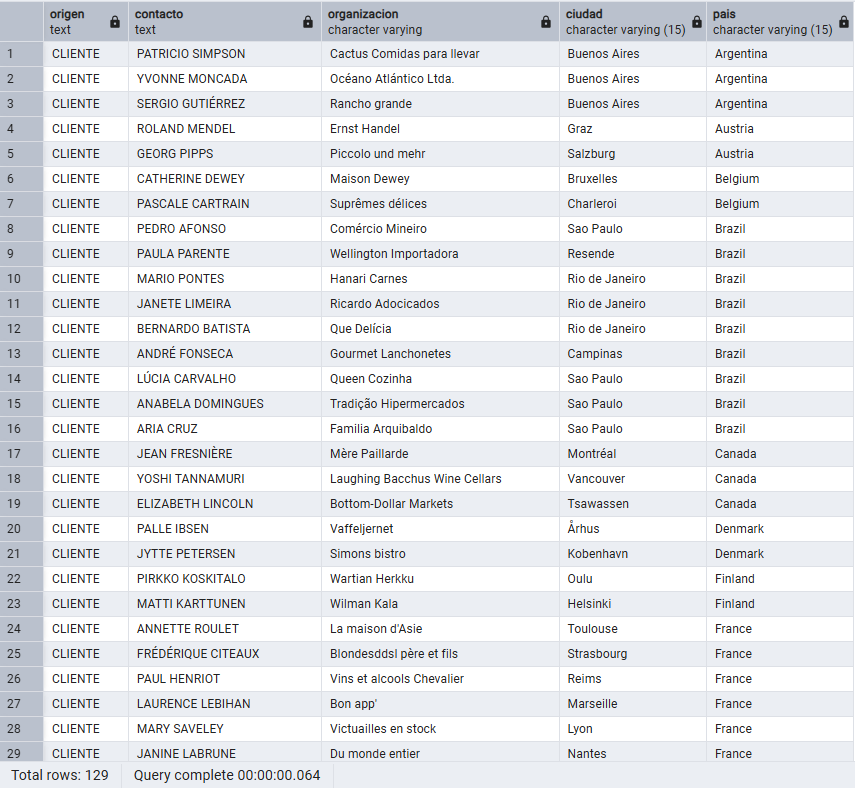

**Comentario:** Uso UNION ALL porque se quiere conservar todos los contactos aunque coincidan sus datos. Las tres consultas devuelven las mismas cinco columnas y en el mismo orden. 

## ### Pregunta 12 — Mercados con desequilibrio

**Enunciado:** Resuelve las dos preguntas en dos consultas independientes:

**a)** Países donde hay clientes pero **ningún** proveedor.
**b)** Países donde hay **a la vez** clientes y proveedores.

Ordena ambos resultados alfabéticamente.

Ordena por origen y luego por país.


**Consulta:**

```sql
-- Países donde hay clientes pero ningún proveedor.
SELECT country AS pais
	FROM customers 

EXCEPT 
	SELECT country
	FROM suppliers

ORDER BY pais;

-- Países donde hay a la vez clientes y proveedores
SELECT country AS pais
	FROM customers 

INTERSECT 

	SELECT country
	FROM suppliers

ORDER BY pais;
```

**Resultado:**

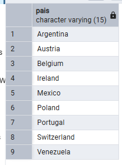

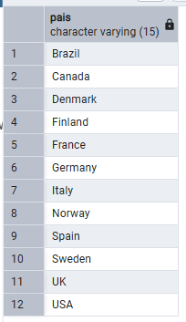


**Comentario:** EXCEPT devuelve los países presentes en clientes pero no en proveedores, o sea los que están en A pero no en B, mientras que INTERSECT devuelve los comunes a ambos conjuntos, o sea los que está en A y en B. Estos operadores eliminan duplicados automáticamente. 
Manera más larga:

````sql
SELECT DISTINCT c.country AS pais
	FROM customers c
	LEFT JOIN suppliers s
		ON c.country = s.country
		WHERE s.supplier_id IS NULL 
	ORDER BY pais;
```
